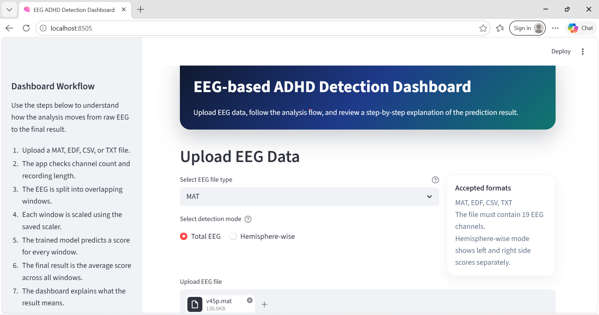
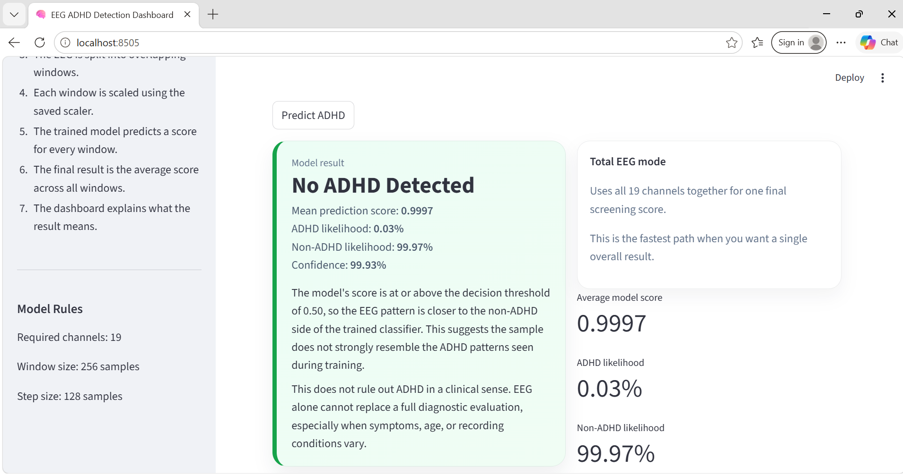
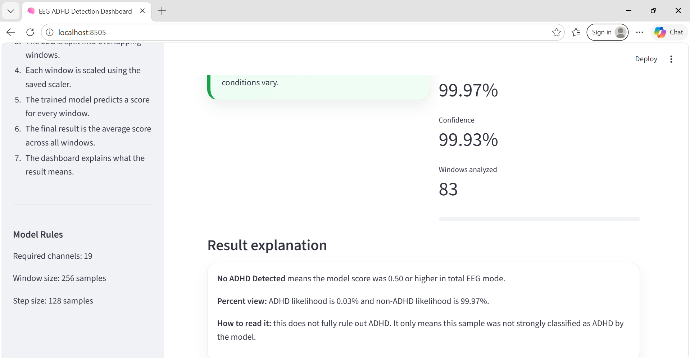
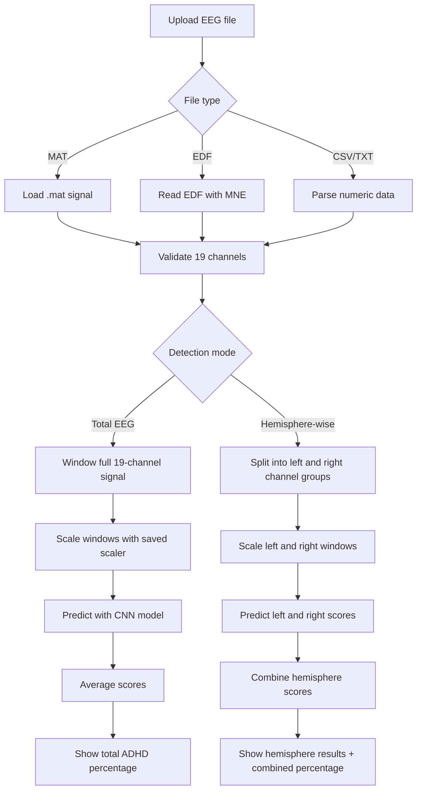
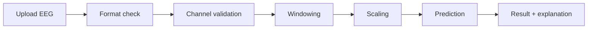

# EEG-based ADHD Detection Dashboard

A Streamlit application for screening ADHD-related patterns from EEG recordings. The app supports two analysis modes:

- Total EEG: uses all 19 EEG channels together
- Hemisphere-wise: evaluates left and right hemisphere channel groups separately and combines the result

The dashboard accepts `MAT`, `EDF`, `CSV`, and `TXT` EEG files, validates the signal, slices the recording into overlapping windows, scales the windows, and uses a trained TensorFlow model to produce a final prediction score.

## Screenshots

### Dashboard home



### Result and interpretation



### Hemisphere-wise comparison



## Project Overview

This project is built around EEG-based machine learning screening. The workflow is designed to:

1. Load EEG recordings from multiple file formats
2. Validate the EEG structure and required channels
3. Convert the signal into overlapping windows
4. Normalize the data using a saved scaler
5. Run prediction with a trained CNN model
6. Show a clear ADHD / No ADHD result with percentages
7. Provide a separate hemisphere-wise view for comparison

## Technologies Used

- Python: main application and data pipeline
- Streamlit: dashboard UI and interactive workflow
- TensorFlow / Keras: trained convolutional neural network model
- NumPy: array handling and signal reshaping
- Pandas: CSV parsing and numeric filtering
- SciPy: `.mat` file loading through `scipy.io.loadmat`
- MNE: EDF file reading and EEG channel handling
- joblib: loading the trained `scaler.pkl`
- scikit-learn: preprocessing and training utilities in the notebook
- Matplotlib: signal plotting and training visualizations in the notebook
- Jupyter Notebook: experimentation, training, and explanation work

## How It Works



## Analysis Workflow

### Step 1: File Upload

The user uploads one EEG file in one of the supported formats.

- `MAT` files are read with `scipy.io.loadmat`
- `EDF` files are read with `mne.io.read_raw_edf`
- `CSV` and `TXT` files are read with `pandas.read_csv`, and the code keeps only numeric columns

### Step 2: Channel Validation

The application expects 19 EEG channels:

`Fp1, Fp2, F3, F4, C3, C4, P3, P4, O1, O2, F7, F8, T7, T8, P7, P8, Fz, Cz, Pz`

Why this matters:

- The trained model was built on a fixed 19-channel layout
- If a channel is missing, the spatial pattern no longer matches the training setup
- Keeping the channel layout consistent reduces input mismatch and prediction noise

### Step 3: Signal Preparation

The signal is reshaped to channel-by-time form and then divided into overlapping windows.

Current window settings:

- Window size: 256 samples
- Step size: 128 samples

Why this matters:

- EEG is non-stationary, meaning patterns change over time
- Windowing lets the model inspect local signal segments instead of one long sequence
- Overlap helps preserve information between adjacent segments

### Step 4: Scaling

Each window is flattened, transformed with the saved `StandardScaler`, and reshaped back.

Why this matters:

- EEG amplitudes can vary across recordings and subjects
- Scaling puts the input into a comparable numeric range
- Models usually learn more reliably when inputs are standardized

### Step 5: Model Prediction

The app loads `model.h5`, which is a TensorFlow/Keras CNN model with input shape `(19, 256, 1)`.

Why this matters:

- CNNs are good at learning local spatial and temporal patterns
- The network learns patterns that correspond to ADHD and non-ADHD classes
- The output is a score between 0 and 1

### Step 6: Final Decision

The final score is interpreted as follows:

- Score below `0.50` -> ADHD Detected
- Score at or above `0.50` -> No ADHD Detected

The dashboard also shows:

- ADHD likelihood percentage
- Non-ADHD likelihood percentage
- Confidence score

### Step 7: Explanation After Result

The dashboard shows the explanation after the result, not before.

This is done so the user sees the prediction first, then the interpretation and meaning.

## Total EEG Mode

Total EEG mode uses all 19 channels together.

How it works:

1. The uploaded recording is validated
2. The full signal is windowed
3. Each window is scaled
4. The CNN predicts a score for every window
5. The app averages all window scores
6. The final score is shown as a percentage and as a label

When to use:

- When you want one overall screening result
- When you want the fastest and simplest interpretation

## Hemisphere-wise Mode

Hemisphere-wise mode evaluates the left and right hemisphere channel groups separately.

Left hemisphere channels:

- Fp1, F3, C3, P3, O1, F7, T7, P7

Right hemisphere channels:

- Fp2, F4, C4, P4, O2, F8, T8, P8

How it works:

1. The full EEG is validated
2. Left and right channel masks are created
3. Two separate signals are built from the same recording
4. Each hemisphere is windowed and scaled
5. The model predicts a score for the left side and right side
6. The app averages both hemisphere scores for a combined result
7. The dashboard also shows the left and right results individually

Why this matters:

- ADHD-related EEG research often examines asymmetry between hemispheres
- Comparing both sides helps the user see whether one side contributes more strongly
- It gives a more interpretable view than a single combined score

## Research Rationale for Each Step

### Why use EEG?

EEG is a low-cost, non-invasive signal that captures brain electrical activity with high temporal resolution. It is useful for pattern recognition tasks because attention-related differences can appear in the timing and distribution of the signal.

### Why use 19 channels?

A 19-channel EEG montage is common in clinical and research EEG setups. It gives enough spatial coverage across frontal, central, temporal, parietal, and occipital regions to capture broad brain activity patterns.

### Why use overlapping windows?

Windowing is important because EEG changes quickly. Overlapping windows provide more training and prediction samples from the same recording and reduce the chance of losing short-lived patterns.

### Why standardize the data?

Standardization reduces the effect of amplitude differences between recordings. This helps the model focus on pattern shape instead of raw scale.

### Why use a CNN?

CNNs are effective at learning local structures in signal data. For EEG, they can learn frequency-like and spatial patterns without manually designing handcrafted features for every recording.

### Why show hemisphere-wise output?

ADHD-related EEG work often looks at asymmetry or side-specific behavior. Showing left and right scores separately gives a more informative interpretation than only one global score.

### Why show percentages?

Percent-style output is easier for users to read than a raw sigmoid score. The dashboard converts the model output into ADHD likelihood and non-ADHD likelihood for a clearer clinical-style presentation.

## Workflow Diagram



## File Structure

- `app.py`: Streamlit dashboard
- `eeg_preprocessing.py`: EEG loading helper
- `eeg_train.ipynb`: full training notebook
- `hemisphere_wise_adhd_detection.ipynb`: hemisphere-based training notebook
- `model.h5`: saved trained model
- `scaler.pkl`: saved scaler
- `data/`: sample EEG data
- `images/`: screenshots used in this README

## How to Run

1. Open a terminal in the project folder.

2. (Optional but recommended) Create and activate a Python virtual environment:

```bash
py -m venv .venv
.\.venv\Scripts\activate
```

3. Install dependencies from `requirements.txt`:

```bash
py -m pip install --upgrade pip
py -m pip install -r requirements.txt
```

4. Ensure the model files are present: `model.h5` and `scaler.pkl` in the project root.

5. Start the Streamlit dashboard:

```bash
py -m streamlit run app.py
```

6. Open the local URL shown in the terminal (usually http://localhost:8501).

Notes:
- If you prefer using `python` instead of the `py` launcher, replace `py -m` with `python -m` in the commands above.
- `mne` may require additional system libraries depending on your OS; see MNE installation docs if you run into errors.

## Notes

- This project is a screening tool, not a medical diagnostic system.
- The final result should be reviewed with clinical context.
- If the result conflicts with symptoms or history, use a qualified clinician's assessment.

## Related Notebook

- `eeg_train.ipynb` explains preprocessing, training, evaluation, and Grad-CAM-style visualization.
- `hemisphere_wise_adhd_detection.ipynb` shows the left and right hemisphere training flow.

## Result Interpretation

- `ADHD Detected`: the signal is closer to the ADHD class learned by the model
- `No ADHD Detected`: the signal is closer to the non-ADHD class learned by the model
- Higher confidence means the score is farther from the `0.50` threshold

## Credits

This project combines EEG preprocessing, CNN-based classification, and Streamlit dashboarding to provide a clear screening-style interface for ADHD analysis.
